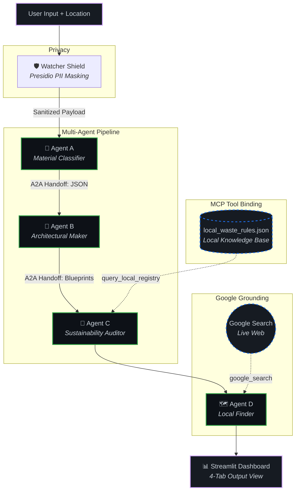

# 🌍 EcoWatcher — Circular Economy AI Agent System

> **Kaggle 5-Day AI Agents Intensive — Vibe Coding Capstone Project**
> Track: Agents for Good (Environmental Sustainability & Circular Economy)

**A privacy-first, multi-agent AI pipeline that transforms unstructured waste data into actionable circular economy solutions.**

---

## 🛑 The Problem
Every day, millions of tons of reusable and recyclable materials end up in landfills because individuals and businesses lack the specific, localized knowledge required to properly upcycle or recycle them. Complex municipal recycling rules and the difficulty of finding local scrap dealers create high friction for sustainable waste management. Furthermore, analyzing personal waste logs often risks exposing sensitive Personally Identifiable Information (PII) to third-party AI models.

## 💡 The Solution
EcoWatcher is an advanced, **4-Agent AI system** designed to optimize the **3Rs of Circular Economy** (Reduce, Reuse, Recycle) by removing all friction from the process. 

Paste unstructured waste descriptions into our dynamic, animated dashboard and let the AI pipeline automatically:
1. **Classify** materials and identify their hazard levels.
2. **Generate** creative, step-by-step upcycling blueprints.
3. **Verify** compliance with strict local municipal recycling protocols.
4. **Locate** actual, real-world scrap dealers near you using live web search.

All of this is accomplished while rigorously protecting your privacy using a built-in Watcher Shield that scrubs PII before any data leaves your machine.

---

## ✨ Key Features

1. **Dynamic UI:** A stunning, animated Streamlit interface with full Light and Dark mode support, featuring micro-animations and a vibrant, eco-centric aesthetic.
2. **Four-Agent Pipeline (ADK):** A robust stateful workflow passing validated structured data from one agent to the next.
3. **Local Knowledge Base (MCP):** Agent C uses an MCP-style tool to cross-reference AI upcycling suggestions against a strict, verified local JSON registry of municipal rules.
4. **Google Search Grounding:** Agent D leverages live web search to find actual, real-world scrap dealers based on your location.
5. **PII Security Guardrails:** Microsoft Presidio actively intercepts and scrubs sensitive personal info (emails, SSNs, API keys) before any data hits the LLM.
6. **Graceful Degradation:** The system intelligently falls back to pre-trained knowledge if the live Google Search quota is exhausted.

---

## 🏗️ Architecture Overview



---

## 📁 Project Structure

| File | Purpose | Course Concepts |
|------|---------|-----------------|
| `local_waste_rules.json` | Regional circular economy knowledge base (4 waste streams) | Day 2: MCP data source |
| `security_guardrails.py` | PII/credential detection & masking before API calls | Day 4: Privacy guardrails |
| `agent_engine.py` | 4-agent pipeline (Classifier → Maker → Auditor → Finder) | Day 1, 2, 3: GenAI, MCP, ADK |
| `app.py` | Streamlit dashboard with animated, dynamic UI | Day 5: Deployment |
| `requirements.txt` | Python dependencies | — |

---

## 🚀 Quick Start

### Prerequisites
- Python 3.10+
- A Google Gemini API key ([get one here](https://aistudio.google.com/apikey))

### 1. Clone & Install

```bash
cd EcoWatcher
python -m venv venv
.\venv\Scripts\activate  # On Windows
pip install -r requirements.txt
```

### 2. Set Your API Key

**Windows (PowerShell):**
```powershell
$env:GEMINI_API_KEY = "your-api-key-here"
```

**Linux / macOS:**
```bash
export GEMINI_API_KEY="your-api-key-here"
```

### 3. Run the Dashboard

```bash
streamlit run app.py
```

The dashboard will open at `http://localhost:8501`.

---

## 🎯 Compliance Matrix — Grading Rubric Targets

| Requirement | Implementation | Evidence |
|-------------|---------------|----------|
| **Agent / Multi-Agent (ADK)** | 4-agent sequential pipeline with A2A handoffs | `agent_engine.py` — Agents A, B, C, D |
| **MCP Server / Tool** | `query_local_registry()` reads local JSON knowledge base | `agent_engine.py` — Agent C tool binding |
| **Search Grounding** | `google_search` tool dynamically finds local dealers | `agent_engine.py` — Agent D |
| **Security Features** | `execute_security_scan()` — PII/credential masking | `security_guardrails.py` |
| **Agent Skills & CLI** | Standalone `__main__` blocks for CLI execution | Both `.py` modules |
| **Deployability** | `streamlit run app.py` — standard reproducible workflow | `app.py` + `requirements.txt` |

---

## 🔒 Security Features (Day 4)

The Watcher Shield scans for:
- 🔑 API keys and secret tokens (AWS, generic)
- 🔐 Passwords and credentials
- 🆔 Social Security Numbers (SSN)
- 💳 Credit card numbers (Visa, MasterCard, Amex)
- 📞 Phone numbers (US/international)
- 📧 Email addresses

All detected sensitive data is masked with `[REDACTED_DATA]` tokens **before** any data is transmitted to the Google GenAI API. An interception log is available directly in the UI under the "🛡️ Watcher Shield" tab.

---

## 📜 License

Built for the Kaggle 5-Day AI Agents Intensive Course — Capstone Project.
